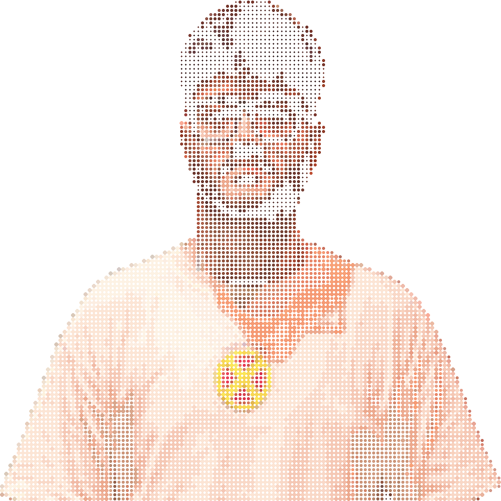
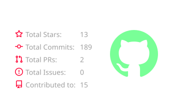

<!-- ==================== HEADER ==================== -->

<!-- ==================== INTRO ==================== -->

<table>
<tr>
<td width="42%" align="center">

</td>

<td width="58%" valign="middle">

<h2>Hi, I'm Nilaksh 👋</h2>

<b>Pre-Final Year CSE @ NIT Delhi</b>

Full-Stack Developer · AI · DSA · Competitive Programming

I enjoy building practical software, solving challenging problems,
and exploring AI-powered applications.

🏆 <b>Knight (Rating: 1850+)</b> @ LeetCode 
⚡ <b>Pupil (Rating: 1200+)</b> @ Codeforces

</td>
</tr>
</table>

 

---

<!-- ==================== TECH STACK ==================== -->

<h2>⚡ Technologies & Tools</h2>

  

 

---

<!-- ==================== GITHUB STATS ==================== -->

<h2>📊 GitHub Stats</h2>

<!-- Self-Hosted Animated Crimson Snake -->

  

 

---

<!-- ==================== CURRENT FOCUS ==================== -->

<h2>🚀 Currently Building</h2>

 

---

<!-- ==================== CONNECT ==================== -->

<h2>🌐 Let's Connect</h2>

 

